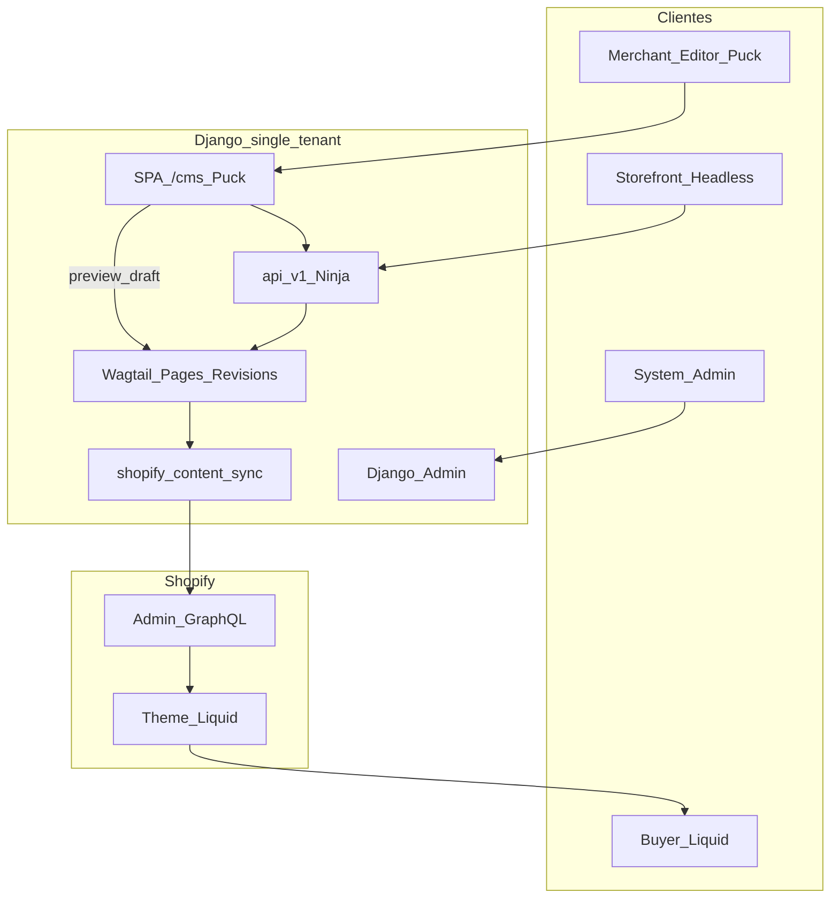

# Plan: Puck como UI CMS (single-tenant)

## Decisiones fijadas

- **Puck** = UI de administración de contenido para merchants/editores (sustituye Wagtail Admin), con **preview** al estilo Wagtail.
- **Django Admin** = solo administradores de sistema (ShopConfig, tokens, API keys, OAuth, sync runs, mounts/layout del Workbench).
- **Wagtail** permanece como capa de modelos/revisiones/sync; la API Ninja es el contrato hacia SPA, agentes y headless.
- **Single-tenant** ahora (una instalación = una tienda), alineado con [`ShopConfig.objects.first()`](backend/shopify_content/sync/outbound.py).
- **Tema Shopify vendible** con estructura de datos flexible (metaobjetos/metafields + Liquid); no App Proxy salvo necesidad futura de preview en el dominio de la tienda.

## Arquitectura objetivo

| Superficie | Quién | Qué hace |
|------------|-------|----------|
| `/cms/` SPA Puck | Merchant / editor | CRUD contenido, publish/push, preview |
| `/admin-django/` | Ops sistema | ShopConfig, keys, OAuth, Celery/sync runs, SpaMount |
| `/api/v1/` | SPA, agentes, headless | Contrato estable de contenido + sync |
| `/admin/` Wagtail | Transición | Apagar o restringir cuando Puck cubra flujos |
| Tema Liquid (`frontend/`) | Comprador | Lee datos ya en Shopify (metaobjetos, products, etc.) |

## Rol de `django-react-ui-editor`

Usar el paquete como **contenedor** de la SPA editorial (no como page-builder del storefront Shopify):

- `register_spa` + `SpaShellView` bajo prefijo `/cms/`.
- Modelo concreto `CmsSpaMount(SpaMount)` para layout del Workbench (pantallas list/detail del CMS).
- Bundles: `editor.js` (Puck en Django Admin solo para ops que afinan plantillas del Workbench) + `spa-public.js` (shell que usan merchants).
- Pantallas de contenido: componentes React de dominio (`GlossaryList`, `ProductForm`, …) que llaman a [`/api/v1/`](backend/api/main.py); **no** APIs ad hoc tipo demo `events/api/`.

Puck aquí compone la **UI del CMS** (listados, formularios, paneles), no el tema Liquid de la tienda. La flexibilidad del tema sigue viniendo de metaobjetos/metafields + sections Liquid.

## Preview (como Wagtail)

Hoy existen templates HTML en [`backend/shopify_content/templates/shopify_content/`](backend/shopify_content/templates/shopify_content/) y la API publica con `publish=true` vía `save_revision().publish()`.

**Preview v1 (Wagtail-like, mismo backend):**

1. SPA guarda borrador: `PATCH` sin publish o endpoint explícito `save_revision`.
2. Endpoint nuevo p.ej. `POST /api/v1/{resource}/{id}/preview/` (o `GET` con token de preview) que renderiza el template Wagtail de esa página (draft/latest revision) y lo muestra en iframe/panel en Puck.
3. No requiere App Proxy ni sync a Shopify para ver el borrador.

**Preview v2 (opcional, más fiel al tema):** iframe o pestaña hacia theme preview / draft metaobject — fuera del MVP.

## Auth y permisos (single-tenant)

- Merchants: sesión Django (staff/grupo `cms_editors`) o sesión embebida Shopify ya usada en [`AppHomeVerifiedMixin`](backend/core/mixins.py) → la SPA bajo `/cms/` misma origen, CSRF + cookie; llamadas a `/api/v1/` con sesión o token de editor (no API keys de agentes).
- Extender [`ApiKeyAuth`](backend/api/auth.py) o añadir auth de sesión/OAuth de usuario editor para la SPA.
- System admins: superuser en Django Admin.
- API keys / OAuth MCP: siguen para agentes; no son el login del merchant.

## Contrato de datos (tema flexible + headless)

Sin cambiar el modelo de sync actual:

- **Liquid:** theme en [`frontend/`](frontend/) consume Shopify (metaobjetos `glossary_term`, `local_page`, products, etc.) tras outbound sync.
- **Headless:** mismos recursos vía `GET /api/v1/...` (y más adelante Storefront API / publicados en Shopify según canal).
- **Estructura flexible:** definiciones de metaobjetos + schemas Ninja; Puck no redefine el schema Shopify — edita campos ya modelados en Wagtail.

## Fases de implementación

### Fase 0 — Cimientos SPA ✅

- Añadir dependencia `django-react-ui-editor` al backend.
- App Django `cms_ui` (o similar): `CmsSpaMount`, `register_spa(url_prefix="cms")`, `VISUAL_EDITOR` settings, `get_spa_urlpatterns()` en [`config/urls.py`](backend/config/urls.py).
- Scaffold frontend Vite (basado en el repo) con shell mínimo y una ruta placeholder.

### Fase 1 — Auth editor + un recurso piloto ✅

- Piloto: **Glossary** (API ya completa en [`api/routers/glossary.py`](backend/api/routers/glossary.py)).
- Pantallas Puck/React: listado, detalle/form, publish/push.
- Auth sesión para `/cms/` y consumo de `/api/v1/glossary/`.
- Django Admin: registrar `CmsSpaMount`; dejar Wagtail Admin intacto (migración gradual).

### Fase 2 — Preview ✅

- Guardado de revision/draft vía API.
- Endpoint preview HTML (templates Wagtail existentes).
- Panel/iframe en la UI Puck “Previsualizar” (paridad UX con Wagtail).

### Fase 3 — Resto de recursos ✅

- Products, collections, blogs/articles, locations — mismos patrones CRUD + publish/push.
- Enlaces desde app embebida Shopify (`shopify-admin`) hacia `/cms/` en lugar de (o además de) Wagtail.

### Fase 4 — Endurecer producto ✅

- Restringir `/admin/` Wagtail a staff interno o deshabilitar para merchants.
- Documentar roles: merchant → Puck; sistema → Django Admin; agentes → API keys.
- Checklist tema vendible: metaobject definitions + theme Liquid + sync outbound como paquete single-tenant.

## Fuera de alcance (esta etapa)

- Multi-tenant / SaaS.
- App Proxy storefront.
- Sustituir el theme editor de Shopify por Puck.
- RFC 001 Context Registry / Auto Data API (bindings dinámicos) — evaluarlo después del piloto glossary.

## Archivos clave a tocar (cuando se ejecute)

- [`backend/config/urls.py`](backend/config/urls.py) — montar SPA + mantener `api/v1`, admin-django, wagtail.
- [`backend/config/settings.py`](backend/config/settings.py) — `INSTALLED_APPS`, `VISUAL_EDITOR`.
- Nueva app `cms_ui/` — mount, registry de componentes CMS, auth helpers.
- [`backend/api/auth.py`](backend/api/auth.py) — auth de editor para SPA.
- [`backend/api/routers/*`](backend/api/routers/) — draft/preview endpoints.
- Nuevo frontend SPA (Vite) empaquetado a static del paquete/app.
- Docs: actualizar [`backend/README.md`](backend/README.md) con las tres superficies (Puck / Django Admin / API).
