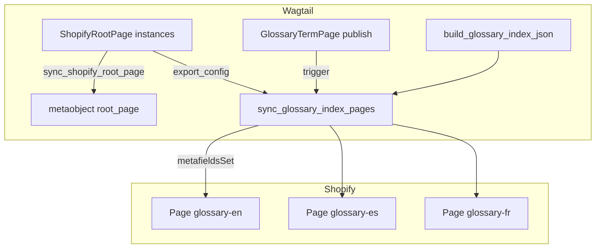

# Glossary index sync + root_page exportable

## Contexto

- Un solo tipo metaobject `glossary_term` (sin triplicar definiciones).
- **Todas** las instancias de [`ShopifyRootPage`](shopify_content/models/root.py) exportan a metaobject `root_page` (patrón [`local_page`](shopify_content/sync/outbound.py) / `glossary_term`).
- El índice de glosario es el primer consumidor de `export_config`; el patrón extiende después a Location, Collection y Product.
- Tres páginas índice en Shopify Admin reciben `custom.glossary_index` + `custom.glossary_locale` (theme Liquid fuera del repo).
- Ledger: [`PROGRESS.md`](../../PROGRESS.md)
- **Multi-tienda:** los GIDs en `export_config` son por instalación. Ver checklist de onboarding en [`theme-index-pages.plan.md`](theme-index-pages.plan.md).

## Arquitectura



| Capa | Recurso | Rol |
|------|---------|-----|
| Config CMS | metaobject `root_page` | Mirror de cada root Wagtail; campo `config` = `export_config` |
| Índice storefront | Shopify Pages (3) | `custom.glossary_index` + `custom.glossary_locale` para Liquid |
| Término | metaobject `glossary_term` | Sin cambios |

## Fases

- [x] Fase 1 — `root_page` + `ShopifyRootPage` exportable
  - Campos sync inline (patrón [`LocationPage`](shopify_content/models/location_page.py), no mixin abstracto)
  - `export_config` JSONField + paneles `SHOPIFY_SYNC_PANELS` / `SHOPIFY_SEO_PANELS`
  - `_root_page_definition()` + `ensure_root_page_definition()` en [`outbound.py`](shopify_content/sync/outbound.py)
  - `sync_shopify_root_page()` + registro en [`publish_sync.py`](shopify_content/sync/publish_sync.py), [`tasks.py`](shopify_content/tasks.py)
  - Registrar en [`ensure_metaobject_definitions`](shopify_content/management/commands/ensure_metaobject_definitions.py)
  - Migración Django

- [x] Fase 2 — Builder y sync del índice glosario
  - `shopify_content/glossary/index.py` — JSON agrupado A–Z / `0-9` / `#`
  - `shopify_content/sync/glossary_index.py` — `metafieldsSet` a Page GIDs desde `export_config.glossary_index`
  - Esquema `export_config` para root `slug=glossary` (ver abajo)
  - Celery `sync_glossary_index_task` + signal `page_unpublished` en [`signals.py`](shopify_content/signals.py)
  - Comando `rebuild_glossary_index [--locale] [--dry-run]`

- [x] Fase 3 — Tests y documentación
  - `shopify_content/tests/test_root_page_sync.py`
  - `shopify_content/tests/test_glossary_index.py`
  - Actualizar [`docs/shopify_content.md`](docs/shopify_content.md) (root_page, export_config, índice, setup Shopify Admin)
  - `make test`

## Esquema `export_config` (root glossary)

```json
{
  "glossary_index": {
    "enabled": true,
    "pages": {
      "en": "gid://shopify/Page/...",
      "es": "gid://shopify/Page/...",
      "fr": "gid://shopify/Page/..."
    }
  }
}
```

## Esquema `custom.glossary_index` (contrato theme)

```json
{
  "version": 1,
  "locale": "es",
  "generated_at": "ISO8601",
  "count": 70,
  "sections": [
    {"key": "A", "items": [{"term": "...", "handle": "...", "path": "/pages/glossary/..."}]}
  ]
}
```

## Setup Shopify Admin (manual)

Metafield definitions (owner `PAGE`):

| Namespace | Key | Type |
|-----------|-----|------|
| `custom` | `glossary_locale` | `single_line_text_field` |
| `custom` | `glossary_index` | `json` |

Metaobject `root_page`: creado por `python manage.py ensure_metaobject_definitions`.

## Extensibilidad futura (no v1)

Claves previstas en `export_config`: `location_index`, `collection_overrides`, `product_overrides`.

## Fuera de alcance v1

- Plantillas Liquid en el repo
- Crear Shopify Pages desde Wagtail
- UI avanzada para `export_config` (v1 = JSONField)
- Endpoints API nuevos (solo management command + sync automático)
- `onlineStore` en `root_page`
- Sync locale-aware de `related_glossary_terms` en productos

## Criterios de aceptación

- [x] Cada `ShopifyRootPage` publicado crea/actualiza metaobject `root_page` con `config` = `export_config`
- [x] Publicar/unpublish `GlossaryTermPage` actualiza `custom.glossary_index` en las Pages configuradas
- [x] Índice agrupa por letra; solo términos `live` con `shopify_id`
- [x] `rebuild_glossary_index --dry-run` imprime JSON sin push
- [x] `make test` pasa con tests nuevos
- [x] `docs/shopify_content.md` documenta el flujo completo

## Estado

**v1 completado.** Operación pendiente fuera del plan (manual en Shopify Admin):

1. Crear metafield definitions en Pages (`glossary_locale`, `glossary_index`)
2. Crear 3 páginas índice y pegar GIDs en `export_config` del root Wagtail `glossary`
3. Publicar root glossary y ejecutar `python manage.py rebuild_glossary_index`

Siguiente iniciativa sugerida: [`root-export-config-admin.plan.md`](root-export-config-admin.plan.md) (UI tipada para `export_config`).
