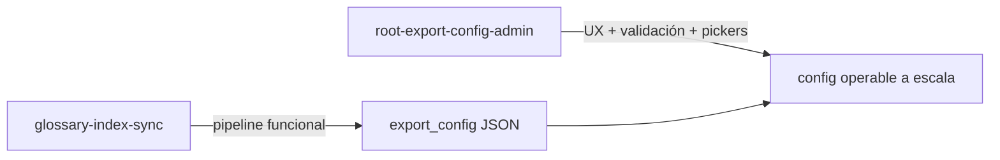
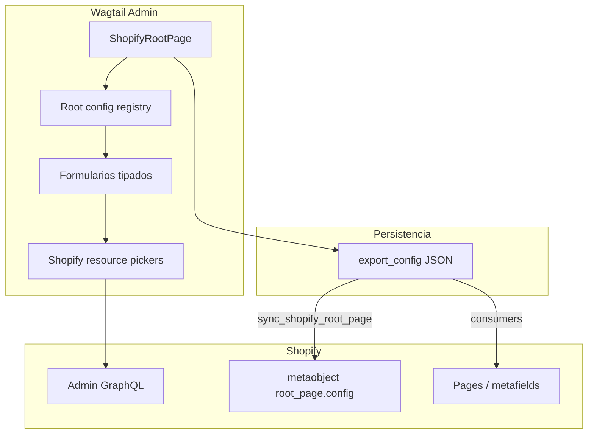

# Root export_config — admin tipado y pickers Shopify

Plan **estratégico** (objetivos y fases de outcome). No reemplaza el plan activo [`glossary-index-sync.plan.md`](glossary-index-sync.plan.md).

## Contexto

- [`ShopifyRootPage`](../../shopify_content/models/root.py) exporta `export_config` → metaobject `root_page.config` en Shopify.
- v1 usa un `JSONField` con `FieldPanel` crudo; el primer consumidor es [`glossary_index`](../../shopify_content/sync/glossary_index.py).
- El plan activo entregó el **pipeline de sync**; este plan define cómo hacer la configuración **operable y escalable** para editores.
- Ledger: [`PROGRESS.md`](../../PROGRESS.md)

## Relación con plan activo

| Plan activo (`glossary-index-sync`) | Este plan |
|-------------------------------------|-----------|
| Builder, Celery, signals, `rebuild_glossary_index` | Formularios por root, validación, pickers |
| `export_config` como JSON manual | Misma data, mejor superficie de edición |
| Setup manual documentado | Reducir dependencia del setup manual |
| Criterio: sync correcto | Criterio: editor autónomo y configs válidas |

## Visión

Convertir `export_config` de JSON técnico en **configuración de storefront gobernada por Wagtail**: formularios específicos según `resource_type` / slug del root, validación en admin y selección de recursos Shopify sin salir de Wagtail.

## Objetivos estratégicos

1. **Usabilidad editorial** — Cada root muestra solo campos relevantes a su tipo.
2. **Integridad de datos** — Validación antes de guardar/publicar; configs inválidas no llegan a producción.
3. **Descubrimiento Shopify** — Seleccionar Pages (y luego otros recursos) desde el admin, no copiar GIDs.
4. **Extensibilidad** — Patrón repetible para `location_index`, overrides, etc.
5. **Compatibilidad** — `export_config` JSON sigue siendo la fuente de verdad hacia Shopify; la UI es capa encima.
6. **Separación de responsabilidades** — Wagtail configura *qué* y *dónde*; el theme define *cómo* se renderiza.

## Principios de diseño

- Schema por tipo de root, no un formulario universal.
- Serialización bidireccional UI tipada ↔ `export_config`.
- Progressive disclosure — GIDs y flags avanzados en sección “Advanced”.
- Fail fast en admin, no en Celery.
- Shopify como catálogo; Wagtail como decisión.
- **Pickers** deben listar Pages **de la tienda conectada** (`ShopConfig.shop` vía Admin API), no GIDs de ejemplo de documentación.
- Bootstrap automático (crear Pages/metafields) es iniciativa **hermana**, no prerrequisito.

## Arquitectura objetivo

| Capa | Rol |
|------|-----|
| Registry | Mapea `resource_type` / slug → esquema + paneles Wagtail |
| Formularios tipados | Editores, help text, validación |
| Pickers | Autocomplete / chooser contra Admin API |
| `export_config` | Payload canónico para sync existente y futuro |

## Pilares

| Pilar | Outcome |
|-------|---------|
| **A — Config gobernada** | Contrato formal por tipo de root; `glossary_index` como primer esquema |
| **B — Admin Wagtail** | Paneles nativos por root; cero JSON en flujo feliz |
| **C — Pickers Shopify** | Listar/elegir Pages (extensible a otros recursos) |
| **D — Validación y ops** | Errores en formulario; opcional estado/rebuild desde el root |
| **E — Multi-root** | Registry plug-in; nuevos tipos sin tocar `ShopifyRootPage` monolítico |

## Fases (outcome, no tácticas)

- [ ] Fase 0 — Fundamentos
  - Registry + esquema formal `glossary_index`; JSON sigue siendo fuente de verdad
  - Depende de: plan activo completado (sync pipeline)

- [ ] Fase 1 — UI glossary
  - Formulario Wagtail para `glossary_index` (enabled + pages en/es/fr) con validación
  - Sin pickers aún; GID manual permitido en “Advanced”

- [ ] Fase 2 — Pickers Shopify
  - Selección de Pages desde admin; GIDs resueltos al guardar
  - Requiere scopes/API documentados

- [ ] Fase 3 — Operabilidad
  - Acciones editoriales (rebuild, estado, mensajes) en el root glossary

- [ ] Fase 4 — Segundo root
  - Validar patrón con otro consumidor (`location_index` u overrides)

- [ ] Fase 5 — Plataforma
  - Registry documentado; onboarding de nuevos tipos sin rediseño

## Criterios de éxito

- Editor configura índice glosario sin JSON ni Shopify Admin (flujo feliz).
- Configs inválidas no se publican en el root `glossary`.
- Nuevo bloque `export_config` para otro root no rompe el formulario glossary.
- `root_page.config` en Shopify permanece compatible con consumidores actuales.
- Esquemas viven junto al registry, no solo en docs sueltos.

## Fuera de alcance

- Plantillas Liquid del theme
- Creación automática de Pages/metafields (plan hermano de bootstrap)
- UI de `GlossaryTermPage` (ya existe)
- Reemplazar o cerrar `glossary-index-sync`
- Traducciones / Markets como dimensión de config (evaluar después)

## Riesgos

| Riesgo | Mitigación |
|--------|------------|
| Divergencia UI ↔ JSON | Capa única de serialización; tests round-trip |
| Latencia listando Pages | Caché, debounce, fallback GID manual |
| Scopes insuficientes | Auditar antes del Pilar C |
| Scope creep | UI solo **selecciona** recursos existentes |

## Decisiones abiertas

1. Registry key: `resource_type`, `slug`, o ambos con fallback?
2. Pickers: solo Page al inicio, o abstracción genérica “Shopify resource”?
3. Migración: script one-shot de JSON existente, o convivencia en paralelo?
4. Permisos: todos los editores o grupo “Shopify config”?
5. Prioridad post-glossary: `location_index` vs overrides producto/colección?

## Extensibilidad futura (referencia)

Claves previstas en `export_config`: `location_index`, `collection_overrides`, `product_overrides`.

## Siguiente paso (cuando se active)

Formalizar esquema `glossary_index` como primer contrato del registry y definir outcome de Fase 1 (formulario + validación, sin pickers).
