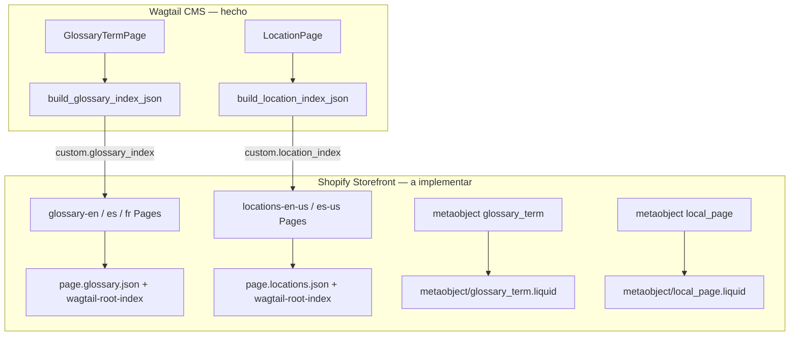

# Theme — índices A–Z y páginas CMS (Liquid)

> **Nota (2026-07):** Las fases 1–3 de listado índice están **completadas** vía section unificada [`wagtail-root-index`](wagtail-root-index-section.plan.md) (`templates/page.glossary.json`, `page.locations.json`). Las fases 2–3 originales (plantillas `.liquid` separadas) quedan **superseded**. **SEO hreflang/noindex:** prohibido vía section settings/blocks — ver [`wagtail-root-index-section.plan.md`](wagtail-root-index-section.plan.md) y `docs/shopify_content.md` → Anti-patrones SEO.

## Prompt de implementación

> Implementa en el **theme Shopify** (repo del theme, fuera de wagtail-shopify) las plantillas Liquid que consumen los datos que el backend Wagtail ya empuja a Shopify. El backend **no renderiza HTML**; solo precomputa JSON en metafields de Pages y sincroniza metaobjects merchant-owned. Tu trabajo es leer esos datos en Liquid, renderizar UI accesible y SEO-friendly, y conectar navegación entre locales.
>
> **Prerrequisitos operativos (por tienda — ejecutar en cada instalación):**
> - `python manage.py ensure_page_metafield_definitions`
> - `python manage.py bootstrap_index_pages --apply-export-config`
> - `python manage.py rebuild_glossary_index` → `pushed` = número de locales en `export_config.glossary_index.pages`
> - `python manage.py rebuild_location_index` → `pushed` = número de locales en `export_config.location_index.pages`
>
> **Referencias de contrato:** [`docs/shopify_content.md`](../../docs/shopify_content.md), builders en [`shopify_content/glossary/index.py`](../../shopify_content/glossary/index.py) y [`shopify_content/locations/index.py`](../../shopify_content/locations/index.py).

## Contexto arquitectónico



| Recurso Shopify | Origen Wagtail | Rol en theme |
|-----------------|----------------|--------------|
| Page `glossary-{locale}` | `export_config.glossary_index.pages` | Listado A–Z por idioma |
| Page `locations-{lang}-us` | `export_config.location_index.pages` | Listado por estado |
| Metaobject `glossary_term` | `GlossaryTermPage` | Detalle de término |
| Metaobject `local_page` | `LocationPage` | Detalle de ubicación |
| Metaobject `root_page` | `ShopifyRootPage` | Config mirror (opcional v1) |

## Contratos de datos (backend → theme)

### Metafields en Shopify Pages (owner `PAGE`, namespace `custom`)

| Key | Tipo | Consumer |
|-----|------|----------|
| `glossary_locale` | `single_line_text_field` | Código locale del índice: `en`, `es`, `fr` |
| `glossary_index` | `json` | Payload precomputado del listado glosario |
| `location_locale` | `single_line_text_field` | Código locale: `en-US`, `es-US` |
| `location_index` | `json` | Payload precomputado del listado locations |

### Convención de handles (todas las tiendas)

Los handles son **convención de bootstrap**, no datos de un merchant concreto. Los GIDs se crean en runtime al ejecutar `bootstrap_index_pages` en la tienda conectada (`ShopConfig.shop`).

| Handle | Metafield locale | Valores locale |
|--------|------------------|----------------|
| `glossary-en` | `glossary_locale` | `en` |
| `glossary-es` | `glossary_locale` | `es` |
| `glossary-fr` | `glossary_locale` | `fr` |
| `locations-en-us` | `location_locale` | `en-US` |
| `locations-es-us` | `location_locale` | `es-US` |

Alias legacy (redirect): `locations-en` → `locations-en-us`, `locations-es` → `locations-es-us` (creados por bootstrap).

**Nunca copiar GIDs** de `export_config` entre instalaciones. Cada merchant ejecuta su propio bootstrap.

### Onboarding nueva tienda

Checklist al instalar la app en `{shop}.myshopify.com`:

1. Completar OAuth → `ShopConfig` con token válido.
2. `python manage.py ensure_metaobject_definitions`
3. `python manage.py ensure_page_metafield_definitions`
4. Crear roots Wagtail `glossary` y `local-us` (si no existen).
5. `python manage.py bootstrap_index_pages --apply-export-config` — crea Pages + escribe GIDs en `export_config`.
6. `python manage.py rebuild_glossary_index` + `python manage.py rebuild_location_index`
7. En Theme Editor: asignar template `page.glossary` / `page.locations` a las Pages por handle.
8. Smoke test: `/pages/glossary-en` y `/pages/locations-en-us` → 200 con listado.

Ver también [`docs/shopify_content.md`](../../docs/shopify_content.md) → Onboarding tienda nueva.

### JSON `custom.glossary_index`

```json
{
  "version": 1,
  "locale": "es",
  "generated_at": "2026-07-05T12:00:00+00:00",
  "count": 70,
  "sections": [
    {
      "key": "A",
      "items": [
        {
          "term": "Afrodisíaco",
          "handle": "afrodisiaco",
          "path": "/pages/glossary/afrodisiaco"
        }
      ]
    }
  ]
}
```

**Reglas del builder (no reimplementar en Liquid):**

- Solo términos **live** con `shopify_id` en Wagtail.
- Agrupación por `key`: `A`–`Z`, `0-9`, `#` (orden fijo en `sections[]`).
- `path` siempre `/pages/glossary/{handle}`.
- `locale` en metafield y en JSON deben coincidir.

### JSON `custom.location_index`

```json
{
  "version": 1,
  "locale": "en-US",
  "generated_at": "2026-07-05T12:00:00+00:00",
  "count": 42,
  "sections": [
    {
      "key": "California",
      "items": [
        {
          "titulo": "Los Angeles Store",
          "handle": "los-angeles-store",
          "path": "/pages/location/los-angeles-store",
          "city": "Los Angeles",
          "state": "California"
        }
      ]
    }
  ]
}
```

**Reglas del builder:**

- Solo locations **live** con `shopify_id`.
- Agrupación por `state`; sin estado → sección `#` al final.
- `path` siempre `/pages/location/{handle}`.
- Filtrado por locale Wagtail/Shopify (`en-US`, `es-US`).

### Metaobject `glossary_term` (detalle)

| Campo metaobject | Tipo | Uso en theme |
|------------------|------|--------------|
| `term` | single line | H1, breadcrumb |
| `definition` | rich text | Cuerpo principal |
| `image` | file reference | Hero / OG image |
| `locale` | single line | Selector de idioma (`en`/`es`/`fr`) |
| `meta_title` | single line | `<title>` (capability renderable) |
| `meta_description` | multi line | meta description |
| `related_links` | json | Enlaces internos legacy |
| `external_links` | json | Enlaces externos |
| `synonyms` | list.single_line_text_field | Chips / SEO |
| `same_as` | list.url | Schema.org `sameAs` |
| `related_products` | list.product_reference | Bloque relacionados |
| `related_collections` | list.collection_reference | Bloque relacionados |
| `related_articles` | list.article_reference | Bloque relacionados |
| `related_glossary_terms` | list.metaobject_reference | Términos relacionados |

**URL de detalle:** capability `onlineStore` del metaobject (handle por término). El índice enlaza vía `path` precomputado.

### Metaobject `local_page` (detalle)

| Campo | Sección UI sugerida |
|-------|---------------------|
| `titulo`, `subtitulo`, `intro` | Hero |
| `country`, `state`, `city`, `locale` | Localización / breadcrumb |
| `titulo_2`, `subtitulo_h2`, `content_2` | Sección 2 |
| `titulo_3`, `subtitulo_3`, `content_3` | Sección 3 |
| `brand_section_*` | Brand |
| `map_title`, `map_content` | Mapa |
| `after_page_content` | Cierre |
| `faqs` | json → accordion FAQ |

Capability `onlineStore` con `urlHandle: local-page` → URLs `/pages/location/{handle}`.

## Fases de implementación

### Fase 1 — Snippet compartido: parseo JSON de índice

- [x] `snippets/wagtail-root-index-parse.liquid` — lee `glossary_index` / `location_index`, expone `index`, `locale`, `has_index`, valida `version`.

### Fase 2 — Índice glosario (superseded → section unificada)

- [x] `templates/page.glossary.json` con section `wagtail-root-index` (`index_mode: glossary`).
- [x] Nav A–Z, listado, búsqueda y accesibilidad en `sections/wagtail-root-index.liquid`.
- [x] **Switcher + hreflang:** `custom.index_alternates` (Wagtail push) — **no** links hardcoded ni section blocks. Ver [`wagtail-root-index-section.plan.md`](wagtail-root-index-section.plan.md).

### Fase 3 — Índice locations (superseded → section unificada)

- [x] `templates/page.locations.json` con section `wagtail-root-index` (`index_mode: location`).
- [x] Agrupación por estado, grid/list, switcher vía `index_alternates`.

### Fase 4 — Plantilla detalle `glossary_term`

- [ ] Crear/actualizar plantilla metaobject `glossary_term` en theme:
  - H1 = `metaobject.term`.
  - Cuerpo = `metaobject.definition` (rich text ya viene HTML).
  - Imagen si `metaobject.image`.
  - Bloque synonyms como lista.
  - **Enlaces relacionados:** preferir refs nativas:
    ```liquid
    
      <a href="{{ product.url }}">{{ product.title }}</a>
    
    ```
  - Fallback a `related_links` JSON si refs vacías.
  - Breadcrumb: índice locale → término (`/pages/glossary-{locale}` → término).
  - JSON-LD `DefinedTerm` con `sameAs` desde `metaobject.same_as`.

### Fase 5 — Plantilla detalle `local_page`

- [ ] Crear/actualizar plantilla metaobject `local_page`:
  - Secciones según tabla de campos.
  - FAQs desde `metaobject.faqs` (parse json).
  - Breadcrumb: índice locations → ciudad/estado → título.
  - JSON-LD `LocalBusiness` o `Store` según datos disponibles.

### Fase 6 — Navegación, SEO e i18n

- [ ] Añadir enlaces en header/footer al índice glosario del locale activo de la tienda.
- [ ] Mapeo locale Shopify Markets ↔ `glossary_locale` / `location_locale`:
  - Glosario: `en` / `es` / `fr` (no incluye sufijo país).
  - Locations: `en-US` / `es-US`.
- [x] **hreflang / x-default / noindex (índices):** solo vía Page metafields `custom.index_alternates` y `custom.index_noindex`, emitidos en `<head>` por `snippets/wagtail-root-index-head.liquid` (hook en `layout/theme.liquid`). Wagtail los empuja en cada `rebuild_*_index` / `PageIndexConsumer.sync()`. **Prohibido:** section settings, blocks `alternate_locale`, links hardcoded, `root_page.config` GIDs.
- [ ] Verificar view-source: `<link rel="alternate" hreflang=...>` presentes tras `rebuild_glossary_index`.
- [ ] Verificar que `path` del JSON coincide con rutas reales del metaobject (smoke test 3 términos + 3 locations).

### Fase 7 — QA y documentación theme

- [ ] Theme check / Lighthouse en Pages índice y 2 detalles por tipo.
- [ ] Documentar en README del theme: handles, templateSuffix, dependencia de metafields.
- [ ] Checklist post-deploy Wagtail: publish término → índice se actualiza en ≤ Celery latency; refresh storefront.

## Patrones Liquid recomendados

### Leer índice glosario en page template

```liquid


  
  

```

### Loop secciones

```liquid

  <nav aria-label="Alphabetical index">
    
      <a href="#glossary-{{ section.key }}">{{ section.key }}</a>
    
  </nav>
  
    <section id="glossary-{{ section.key }}">
      <h2>{{ section.key }}</h2>
      <ul>
        
          <li><a href="{{ item.path }}">{{ item.term }}</a></li>
        
      </ul>
    </section>
  

```

## Criterios de aceptación

- [x] `/pages/glossary-en` (y es/fr) renderizan listado A–Z desde `custom.glossary_index` sin llamadas AJAX al backend Wagtail.
- [x] `/pages/locations-en-us` (y es-us) renderizan listado por estado desde `custom.location_index`.
- [ ] Detalle de término metaobject muestra `term`, `definition`, SEO y al menos un bloque de enlaces relacionados.
- [ ] Detalle `local_page` renderiza hero, secciones rich text y FAQs.
- [ ] Enlaces del índice resuelven a URLs 200 **en la tienda donde se ejecutó bootstrap** (no 404).
- [ ] Tras `rebuild_glossary_index` en Wagtail, un refresh del storefront refleja cambios (sin redeploy theme).
- [ ] Mobile-first, contraste WCAG AA en nav A–Z.

## Fuera de alcance v1

- Crear o editar Pages/metafields desde el theme (solo lectura).
- Lógica de agrupación A–Z o por estado en Liquid (ya viene en JSON).
- Consumo de `root_page.config` para routing dinámico (v2).
- `theme_config` en productos/colecciones (plan separado).
- App embed / Storefront API proxy a Wagtail.
- Traducciones Shopify Translate & Adapt de metafields JSON.

## Dependencias backend (no tocar en este plan)

| Comando | Cuándo |
|---------|--------|
| `rebuild_glossary_index` | Tras bulk import o si índice desincronizado |
| `rebuild_location_index` | Idem locations |
| `bootstrap_index_pages --apply-export-config` | Nueva tienda |
| Publish/unpublish término o location | Sync automático vía Celery |

## Verificación cruzada con backend

```bash
# Wagtail — regenerar índices
python manage.py rebuild_glossary_index --dry-run   # inspeccionar JSON
python manage.py rebuild_glossary_index
python manage.py rebuild_location_index

# Shopify Admin API — confirmar metafield poblado (GID de ESTA tienda)
python manage.py shell -c "
from core.models import ShopConfig
from shopify_content.models import ShopifyRootPage
from shopify_requests.graphql_service import execute_admin_graphql

shop = ShopConfig.objects.first().shop
root = ShopifyRootPage.objects.get(slug='glossary')
page_gid = root.export_config['glossary_index']['pages']['en']
q = '''query(\$id: ID!) {
  node(id: \$id) {
    ... on Page {
      handle
      metafield(namespace: \"custom\", key: \"glossary_index\") { value }
    }
  }
}'''
print(execute_admin_graphql(q, shop=shop, variables={'id': page_gid}).data)
"
```

Alternativa por handle (sin depender de `export_config` en Wagtail):

```bash
python manage.py shell -c "
from core.models import ShopConfig
from shopify_requests.graphql_service import execute_admin_graphql

shop = ShopConfig.objects.first().shop
q = '''query { pages(first: 1, query: \"handle:glossary-en\") {
  edges { node { id handle } }
}}'''
print(execute_admin_graphql(q, shop=shop).data)
"
```

### Troubleshooting 404 en índices

Síntoma: `/pages/glossary-en` (u otro handle canónico) devuelve 404 o página vacía en el storefront.

1. Confirmar que `ShopConfig.shop` coincide con la tienda del `shopify theme dev` (misma instalación OAuth).
2. Si no coincide: reinstalar la app vía OAuth o corregir el token en `ShopConfig`.
3. Si `export_config` tiene GIDs de otra tienda (copiados manualmente o bootstrap en otro entorno):
   ```bash
   python manage.py ensure_page_metafield_definitions
   python manage.py bootstrap_index_pages --apply-export-config
   python manage.py rebuild_glossary_index
   python manage.py rebuild_location_index
   ```
4. En Shopify Admin: verificar que existen Pages con handles canónicos y metafields `glossary_index` / `location_index` poblados.
5. En Theme Editor: confirmar `templateSuffix` / template asignado (`page.glossary`, `page.locations`).

**Causa habitual:** GIDs en `export_config` de una tienda distinta a la conectada. Los handles son estables; los GIDs no. Nunca copiar GIDs entre instalaciones.

## Modelo de despliegue

**No es multi-tenant.** Cada despliegue (Django + Wagtail + app Shopify Partners) sirve **exactamente una tienda**:

- `shop` en runtime: `ShopConfig` tras OAuth (no hardcodear en planes).
- Credenciales app: `.env` (`SHOPIFY_API_KEY`, `SHOPIFY_APP_URL`, etc.).
- Theme preview: `shopify theme dev --store <dominio>` o `.shopify/project.json` (`dev_store_url`) — configuración local, fuera de los planes.

El proyecto es **replicable**: otra instancia + otra tienda = otro `ShopConfig` + otro bootstrap. Handles y contratos JSON son estables entre instalaciones; los GIDs no.

## Estado

**Backend completado.** **Índices (fases 1–3) completados** en theme vía `wagtail-root-index`. Pendiente: detalle metaobject (fases 4–5), nav global y QA (fases 6–7).

## Planes relacionados

- [`wagtail-root-index-section.plan.md`](wagtail-root-index-section.plan.md) — section unificada + política SEO (hreflang solo metafields; **no** section blocks)
- [`glossary-index-sync.plan.md`](glossary-index-sync.plan.md) — backend índice glosario (completado)
- [`root-export-config-admin.plan.md`](root-export-config-admin.plan.md) — UI Wagtail para `export_config` (futuro)
