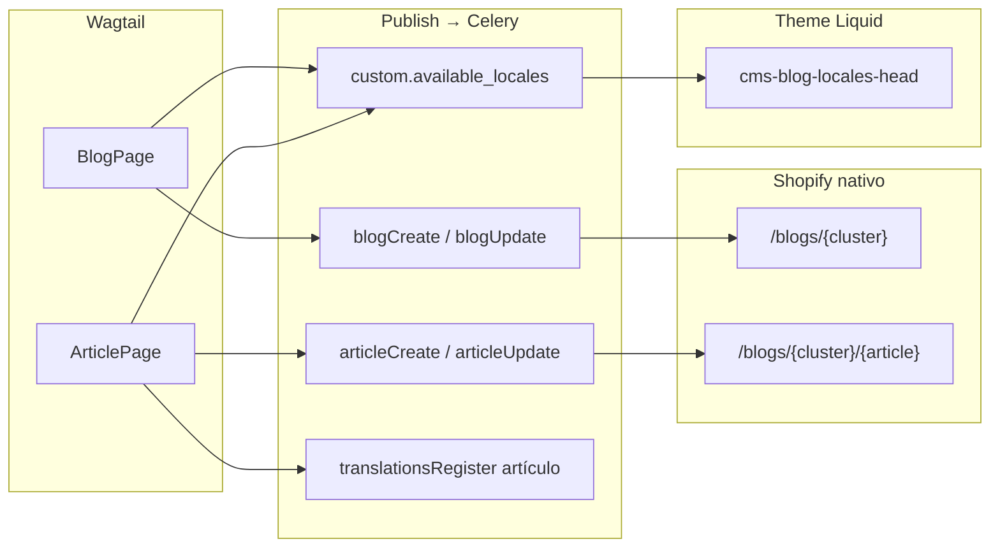

# App `shopify_content`

App principal del CMS. Gestiona los modelos de página Wagtail que se sincronizan automáticamente con Shopify Admin vía GraphQL al publicar.

---

## Rol de la app

`shopify_content` convierte Wagtail en un CMS headless para Shopify:

- Los editores crean y editan contenido en Wagtail Admin.
- Al publicar una página, el hook `after_publish_page` **encola** la sincronización outbound vía Celery (no bloquea el publish).
- Las importaciones inbound (Wagtail admin, app embebida, API `POST */pull`) también se ejecutan en background.
- El estado de cada job se registra en `ShopifySyncRun` (Django Admin). Ver README → sección Celery para worker/beat.
- El storefront de Shopify sigue sirviendo al cliente final.

El proyecto es **single-tenant**: una instalación Wagtail = una tienda Shopify. El `shop` se resuelve desde `ShopConfig.objects.first().shop`; no se almacena en cada página.

La app es **instalable en cualquier merchant**: cada instalación ejecuta su propio bootstrap; los GIDs en `export_config` son exclusivos de esa tienda. Nunca reutilizar `export_config` exportado de otra instalación.

---

## Onboarding tienda nueva

Checklist al instalar la app en una tienda Shopify nueva (`{shop}.myshopify.com`):

1. Completar OAuth → `ShopConfig` con token válido.
2. `python manage.py ensure_metaobject_definitions`
3. `python manage.py ensure_index_metafield_definitions`
4. En Wagtail: crear `ShopifyRootPage` con slug `glossary`, `local-us` y `blogs` bajo el root del sitio (si no existen).
5. `python manage.py migrate_glossary_locales` — asigna Wagtail Locale a términos existentes.
6. `python manage.py bootstrap_index_pages --apply-export-config` — crea Pages `glossary`, `locations`, `blogs` + `page_gid` en `export_config`.
7. Si migras desde arquitectura multi-page: `python manage.py migrate_index_export_config --apply`.
8. `python manage.py rebuild_glossary_index` + `python manage.py rebuild_location_index` + `python manage.py rebuild_blog_index`
9. En Theme Editor: asignar `page.glossary` → handle `glossary`, `page.locations` → `locations`, `page.blogs` → `blogs`.
10. Smoke test storefront: `/pages/glossary`, `/pages/locations`, `/pages/blogs` → 200.

### Troubleshooting 404 en índices

| Síntoma | Causa probable | Acción |
|---------|----------------|--------|
| 404 en `/pages/glossary` o `/pages/locations` | Pages no existen en Shopify Admin | `python manage.py bootstrap_index_pages` |
| 404 con Pages existentes pero listado vacío | `export_config` con GIDs de **otra tienda** | `bootstrap_index_pages --apply-export-config` en la tienda activa |
| Page existe pero sin UI de índice | Template no asignado | Theme Editor → `page.glossary` / `page.locations` en handles `glossary` / `locations` |
| Navbar enlaza URL incorrecta | Page handle distinto | Debe ser `/pages/glossary` y `/pages/locations` |

**Verificación con GID de la tienda conectada** (no copiar GIDs de documentación):

```python
from core.models import ShopConfig
from shopify_content.models import ShopifyRootPage
from shopify_requests.graphql_service import execute_admin_graphql

shop = ShopConfig.objects.first().shop
root = ShopifyRootPage.objects.get(slug='glossary')
page_gid = root.export_config['glossary_index']['page_gid']
q = '''query($id: ID!) {
  node(id: $id) {
    ... on Page {
      handle
      metafield(namespace: "custom", key: "index_listings") { value }
    }
  }
}'''
execute_admin_graphql(q, shop=shop, variables={'id': page_gid})
```

---

## Modelos de página

| Modelo Wagtail | Recurso Shopify | Operación de sync |
|----------------|-----------------|-------------------|
| `ShopifyRootPage` | Metaobject merchant-owned (`root_page`) | `metaobjectUpsert` vía `MetaobjectClient` |
| `ProductPage` | Product | `productUpdate` |
| `CollectionPage` | Collection | `collectionUpdate` |
| `BlogPage` | Blog | `blogCreate` / `blogUpdate` |
| `ArticlePage` | Article | `articleCreate` / `articleUpdate` |
| `LocationPage` | Metaobject merchant-owned (`local_page`) | `metaobjectUpsert` vía `MetaobjectClient` |
| `GlossaryTermPage` | Metaobject merchant-owned (`glossary_term`) | `metaobjectUpsert` vía `MetaobjectClient` |
| `HomePage` | Metaobject merchant-owned (`home_page`) | `metaobjectUpsert` vía `MetaobjectClient` |

### Jerarquía de páginas

```
ShopifyRootPage
├── ProductPage  (slug = handle Shopify)
├── CollectionPage
├── BlogPage
│   └── ArticlePage
├── LocationPage  (bajo root slug=local-us)
├── GlossaryTermPage  (bajo root slug=glossary)
└── HomePage  (bajo root slug=cms-home; uno por locale)
```

---

## Mixin base — `models/mixins.py`

Todos los modelos de página (excepto `ShopifyRootPage`) heredan de `ShopifyPageMixin`:

| Campo | Tipo | Descripción |
|-------|------|-------------|
| `shopify_id` | CharField(255) | GID completo del recurso en Shopify (poblado tras el primer sync) |
| `handle` | SlugField(255) | Handle de Shopify (por defecto usa el `slug` de la página) |
| `sync_enabled` | BooleanField | Activa/desactiva el sync para esta página |
| `last_synced_at` | DateTimeField | Timestamp del último sync exitoso |

`FAQItem` (abstract + `Orderable`) define el schema de preguntas frecuentes reutilizado como InlinePanel en cada tipo de página.

---

## ProductPage — `models/product.py`

| Campo Wagtail | Campo Shopify | Notas |
|---------------|---------------|-------|
| `title` (Page) | `title` | Campo built-in de Wagtail |
| `handle` (mixin) | `handle` | |
| `vendor` | `vendor` | |
| `product_type` | `productType` | |
| `tags` | `tags` | ClusterTaggableManager |
| `status` | `status` | Choices: ACTIVE / DRAFT / ARCHIVED |
| `body` | `descriptionHtml` | StreamField → HTML renderizado |
| `seo_title` (Page) | `seo.title` | Campo SEO built-in de Wagtail |
| `search_description` (Page) | `seo.description` | Campo SEO built-in de Wagtail |
| `shopify_images` | `images` (pull) | InlinePanel → URLs absolutas CDN (máx. 10) |
| `metafields` | `metafields` | InlinePanel → `metafieldsSet` (solo outbound / edición manual) |
| `faqs` | metafield `custom.faqs` | InlinePanel → JSON |

---

## CollectionPage — `models/collection.py`

| Campo Wagtail | Campo Shopify | Notas |
|---------------|---------------|-------|
| `title` (Page) | `title` | |
| `handle` (mixin) | `handle` | |
| `sort_order` | `sortOrder` | Choices: MANUAL / BEST\_SELLING / TITLE\_ASC / etc. |
| `description` | `descriptionHtml` | StreamField → HTML |
| `seo_title` (Page) | `seo.title` | |
| `search_description` (Page) | `seo.description` | |
| `image_url` | `image.url` (pull) | URL absoluta CDN |
| `image_alt_text` | `image.altText` (pull) | |
| `metafields` | `metafields` | Solo outbound / edición manual en pull |
| `faqs` | metafield `custom.faqs` | |

---

## BlogPage — `models/blog.py`

| Campo Wagtail | Campo Shopify | Notas |
|---------------|---------------|-------|
| `title` (Page) | `title` | |
| `handle` (mixin) | `handle` | |
| `comment_policy` | `commentPolicy` | Choices: AUTO\_PUBLISHED / CLOSED / MODERATED |
| `description` | metafield `custom.description` | No hay campo nativo en la API |
| `available_locales` | metafield `custom.available_locales` | `list.single_line_text_field`; códigos Wagtail |
| `seo_title` (Page) | metafield `global.title_tag` | La API Blog no tiene campo `seo` nativo |
| `search_description` (Page) | metafield `global.description_tag` | |
| `faqs` | metafield `custom.faqs` | |

`BlogPage` es el padre de `ArticlePage`. Al crear un `BlogPage` sin `shopify_id`, el sync llama `blogCreate`; si ya tiene ID, llama `blogUpdate`.

---

## ArticlePage — `models/blog.py`

| Campo Wagtail | Campo Shopify | Notas |
|---------------|---------------|-------|
| `title` (Page) | `title` | |
| `handle` (mixin) | `handle` | |
| `author` | `author.name` | CharField; AuthorInput en la API |
| `body` | `body` | StreamField → HTML (campo `body`, no `bodyHtml`) |
| `summary` | `summary` | TextField HTML |
| `published_at` | `publishedAt` | DateTimeField |
| `tags` | `tags` | |
| `featured_image_url` | `image.url` (pull) | URL absoluta CDN |
| `featured_image_alt` | `image.altText` (pull) | |
| `featured_image` | — | FK Wagtail Image (manual/API; pull no lo toca) |
| `seo_title` (Page) | metafield `global.title_tag` | No se importa en pull |
| `search_description` (Page) | metafield `global.description_tag` | No se importa en pull |
| `metafields` | `metafields` | Solo outbound / edición manual en pull |
| `faqs` | metafield `custom.faqs` | |
| `available_locales` | metafield `custom.available_locales` | `list.single_line_text_field`; códigos Wagtail |

El `blogId` del padre (`ArticlePage.get_parent().specific.shopify_id`) se pasa en `articleCreate`.

**Clusters semánticos:** `BlogPage.handle` actúa como keyword del cluster en URLs `/blogs/{handle}/{article-handle}`. Puede coincidir con el slug de un término del glosario.

**Locales:** el backend solo empuja `custom.available_locales` (sin `seo.hreflang_*`). El theme emite hreflang custom y `noindex` vía `snippets/cms-blog-locales-head.liquid` (hook en `layout/theme.liquid` antes de `content_for_header`).

### Responsabilidades Blog/Article (Arquitectura A)



| Capa | URL | Mecanismo |
|------|-----|-----------|
| Índice maestro | `/pages/blogs` | `custom.index_listings` (Wagtail → Page) |
| Cluster | `/blogs/{handle}` | Shopify Blog nativo; listado `blog.articles` |
| Artículo | `/blogs/{handle}/{article}` | Shopify Article nativo |

**No hay** `export_config` / `index_listings` por cluster.

### Mapeo Wagtail ↔ hreflang ↔ Markets

| Código Wagtail (`available_locales`) | hreflang | Shopify language | Shopify country |
|--------------------------------------|----------|------------------|-----------------|
| `en-US` | `en-us` | `en` | `US` |
| `es-US` | `es-us` | `es` | `US` |
| `en-CA` | `en-ca` | `en` | `CA` |
| `fr-CA` | `fr-ca` | `fr` | `CA` |

El theme resuelve la locale actual con la misma regla que `cms-wagtail-locale-key.liquid` (`{language}-{COUNTRY}`). Emite `<link rel="alternate">` **solo** para códigos en `available_locales`; si el visitante no está en la lista → `<meta name="robots" content="noindex, follow">`. `x-default` apunta al primer locale de la lista, o `en-US` si está presente.

### Flujo editorial (cluster single-locale)

1. Crear `BlogPage` bajo root `blogs`, `handle=sex-toys-artisans`, locale `en-US`.
2. Marcar `available_locales = ["en-US"]`.
3. Publicar → Shopify Blog en `/blogs/sex-toys-artisans`.
4. Crear `ArticlePage` hijo, mismo locale, `available_locales = ["en-US"]`.
5. Publicar → artículo en `/blogs/sex-toys-artisans/{handle}`.
6. El theme lista artículos con `blog.articles` — sin JSON Wagtail.

Para multi-mercado: ampliar `available_locales` a `["en-US","es-US"]`; Wagtail puede tener variantes por locale + `translationsRegister` en artículo (y blog para título/descripción/SEO).

---

## Blog index (`/pages/blogs`)

Índice maestro multi-locale en una sola Shopify Page handle `blogs`. Wagtail precomputa el JSON y lo empuja a `custom.index_listings`. El SEO de URL lo gestiona Shopify Markets; el theme elige el listado según `request.locale`.

### Jerarquía Wagtail

```
ShopifyRootPage (slug=blogs)
├── BlogPage (handle = cluster keyword)
│   └── ArticlePage
```

### `export_config` en root `blogs`

```json
{
  "blog_index": {
    "enabled": true,
    "page_gid": "gid://shopify/Page/..."
  }
}
```

### Contrato `custom.index_listings`

```json
{
  "version": 1,
  "generated_at": "2026-07-05T12:00:00+00:00",
  "locales": {
    "en-US": {
      "count": 12,
      "sections": [
        {
          "key": "sex-toys-artisans",
          "label": "Sex Toys Artisans",
          "items": [
            {
              "title": "Article title",
              "handle": "article-handle",
              "blog_handle": "sex-toys-artisans",
              "path": "/blogs/sex-toys-artisans/article-handle",
              "published_at": "2026-06-01T10:00:00+00:00"
            }
          ]
        }
      ]
    }
  }
}
```

### Onboarding blog index

```bash
python manage.py ensure_blog_metafield_definitions
python manage.py bootstrap_index_pages --apply-export-config
python manage.py rebuild_blog_index --dry-run
python manage.py rebuild_blog_index
```

### Triggers automáticos

- Publicar/despublicar `ArticlePage` con sync exitoso → rebuild de `index_listings` (Celery).
- Publicar `ShopifyRootPage` slug `blogs` → rebuild completo.

---

## LocationPage — `models/location_page.py`

Implementada como **merchant-owned metaobject** (tipo `local_page`) en Shopify. La definición se crea en el store vía `metaobjectDefinitionCreate`; no requiere TOML ni `shopify app deploy`.

| Campo Wagtail | Campo Shopify (metaobject field) | Sección |
|---------------|----------------------------------|---------|
| `titulo` (requerido) | `titulo` | Hero |
| `subtitulo` | `subtitulo` | Hero |
| `intro` (RichTextField) | `intro` | Hero |
| `country` | `country` | Localización |
| `state` | `state` | Localización |
| `city` | `city` | Localización |
| `titulo_2` | `titulo_2` | Sección 2 |
| `subtitulo_h2` | `subtitulo_h2` | Sección 2 |
| `content_2` (RichTextField) | `content_2` | Sección 2 |
| `titulo_3` | `titulo_3` | Sección 3 |
| `subtitulo_3` | `subtitulo_3` | Sección 3 |
| `content_3` (RichTextField) | `content_3` | Sección 3 |
| `brand_section_title` | `brand_section_title` | Brand |
| `brand_section_subtitle` | `brand_section_subtitle` | Brand |
| `brand_section_content` (RichTextField) | `brand_section_content` | Brand |
| `map_title` | `map_title` | Mapa |
| `map_content` (RichTextField) | `map_content` | Mapa |
| `after_page_content` (RichTextField) | `after_page_content` | Cierre |
| `faqs` (InlinePanel) | `faqs` (tipo `json`) | FAQs |
| `shopify_locale` | `locale` | Locale |

Adicionalmente, `seo_title` y `search_description` de Wagtail se usan como `metaTitleField` y `metaDescriptionField` en las capabilities `renderable` de la definición.

### Capacidades (`capabilities`)

```python
capabilities={
    'publishable': {'enabled': True},
    'onlineStore': {'enabled': True, 'data': {'urlHandle': 'local-page'}},
    'renderable': {'enabled': True, 'data': {
        'metaTitleField': 'titulo',
        'metaDescriptionField': 'subtitulo',
    }},
}
```

### Bootstrap de la definición

```bash
python manage.py ensure_metaobject_definitions
```

Esto llama `MetaobjectClient.ensure_definition()` — idempotente; crea definiciones ausentes y añade campos faltantes a tipos existentes.

---

## GlossaryTermPage — `models/glossary.py`

Implementada como **merchant-owned metaobject** (tipo `glossary_term`) en Shopify. Los términos viven bajo un `ShopifyRootPage` con slug `glossary` (solo organizacional). La página listado `/pages/glossary` la gestiona el theme en Liquid.

| Campo Wagtail | Campo Shopify (metaobject field) |
|---------------|----------------------------------|
| `term` (requerido) | `term` |
| `definition` (RichTextField) | `definition` |
| `shopify_image_id` (File/MediaImage GID) | `image` |
| `locale_code` (`en`/`es`/`fr`) | `locale` |
| `seo_title` (Page) | `meta_title` |
| `search_description` (Page) | `meta_description` |
| `related_links` (JSONField) | `related_links` |
| `external_links` (JSONField) | `external_links` |
| `synonyms` (JSONField, list of strings) | `synonyms` (`list.single_line_text_field`) |
| `same_as` (JSONField, list of URLs) | `same_as` (`list.url`) |

`seo_title` y `search_description` se editan en la pestaña **Promote** del admin Wagtail. En push, `get_seo_title()` / `get_seo_description()` resuelven fallback a `term` / definición en texto plano si están vacíos. Las capabilities `renderable` apuntan a `meta_title` y `meta_description`.

Tras desplegar cambios en la definición, ejecutar `python manage.py ensure_metaobject_definitions` o push de un término con `ensure_definition=True`.

### Índice de glosario (`/pages/glossary`)

Índice maestro multi-locale en una sola Shopify Page handle `glossary`. Wagtail precomputa el JSON y lo empuja a `custom.index_listings` (mismo metafield que blog y locations). El theme elige el listado según `request.locale` → clave Wagtail (`en-US`, etc.).

**Setup**

```bash
python manage.py ensure_index_metafield_definitions
python manage.py migrate_glossary_locales
python manage.py bootstrap_index_pages --apply-export-config
python manage.py rebuild_glossary_index
```

**`export_config` en root `glossary`**

```json
{
  "glossary_index": {
    "enabled": true,
    "page_gid": "gid://shopify/Page/..."
  }
}
```

**Contrato** — slice `locales["en-US"]` dentro de `custom.index_listings`:

```json
{
  "count": 70,
  "sections": [
    {"key": "A", "items": [{"term": "...", "handle": "...", "path": "/pages/glossary/..."}]}
  ]
}
```

Solo entran términos **live** con `shopify_id` no vacío bajo el root `glossary`, filtrados por `Page.locale` (Wagtail). `locale_code` (`en`/`es`/`fr`) se deriva del locale Wagtail para el metaobject Shopify.

**Flujo automático**

- Publicar `GlossaryTermPage` → sync outbound → Celery rebuild completo de `index_listings`.
- Despublicar término → rebuild inmediato (signal `page_unpublished`).
- Publicar root `glossary` → rebuild completo.

```bash
python manage.py rebuild_glossary_index --dry-run
python manage.py rebuild_glossary_index
```

**Migración desde arquitectura multi-page** (`glossary-en`/`es`/`fr`): `python manage.py migrate_index_export_config --apply`. Redirects 301 manuales en Shopify Admin si hace falta.

### ShopifyRootPage — `models/root.py`

Cada instancia de `ShopifyRootPage` exporta a metaobject `root_page`. El campo `export_config` (JSON en Wagtail) se empuja como `config` en Shopify. El root con slug `glossary` usa `export_config.glossary_index` para apuntar a las Pages índice.

| Campo Wagtail | Campo Shopify (metaobject field) |
|---------------|----------------------------------|
| `title` | `title` |
| `slug` | `slug` |
| `get_resource_type()` | `resource_type` |
| `export_config` | `config` |
| `seo_title` (Page) | `meta_title` |
| `search_description` (Page) | `meta_description` |

### Plataforma `export_config`

Wagtail configura *qué* y *dónde* exportar al storefront; el theme Liquid define *cómo* renderizar.

| Root slug | Clave `export_config` | Destino Shopify | Trigger automático |
|-----------|----------------------|-----------------|-------------------|
| `glossary` | `glossary_index` | Page `glossary` (`custom.index_listings`) | publish/unpublish `GlossaryTermPage` |
| `local-us` | `location_index` | Page `locations` (`custom.index_listings`) | publish/unpublish `LocationPage` |
| `blogs` | `blog_index` | Page `blogs` (`custom.index_listings`) | publish/unpublish `ArticlePage` |
| `root` / `collections` | `product_overrides` / `collection_overrides` | (plantillas editoriales; v1 opcional) | — |

Los consumidores viven en `shopify_content/export_config/` (registry plug-in). Cada índice usa `SinglePageListingsConsumer` y empuja `custom.index_listings` a una sola Page (`page_gid` en `export_config`).

#### Cómo agregar un nuevo root/index (sin tocar el theme)

1. Crear un `ShopifyRootPage` con un `slug` nuevo (p. ej. `store-brands`).
2. Implementar `build_*_index_listings()` con envelope multi-locale (`locales` → `{count, sections}`).
3. Crear una subclase de `SinglePageListingsConsumer` en `shopify_content/export_config/` y registrarla en `registry.py`.
4. Añadir spec en `index_pages_bootstrap.py` + `bootstrap_index_pages`; correr `ensure_index_metafield_definitions`.
5. Publicar contenido → Celery rebuild completo de `index_listings`.
6. En el theme: asignar `wagtail-root-index` (o modo `custom` con `index_listings`) desde Theme Editor.

**Responsabilidades**

- `ShopifyRootPage.export_config` → metaobject `root_page.config` (mirror CMS)
- Índices precomputados → metafields JSON en Shopify Pages
- `ProductPage.theme_config` / `CollectionPage.theme_config` → metafields en el recurso Shopify al publicar

### Índice de locations (`/pages/locations`)

Mismo patrón single-page que glosario y blog. Root `local-us`, builder en `shopify_content/locations/index.py`.

```bash
python manage.py bootstrap_index_pages --apply-export-config
python manage.py rebuild_location_index
```

**`export_config` en root `local-us`**

```json
{
  "location_index": {
    "enabled": true,
    "page_gid": "gid://shopify/Page/..."
  }
}
```

**Contrato** — slice `locales["en-US"]` en `custom.index_listings`: `sections[]` con `key` = estado (o `#`); `items[]` con `titulo`, `handle`, `path`, `city`, `state`.

### Theme contract (Liquid)

Referencia canónica para el repo del theme. El theme lee `page.metafields.custom.index_listings`, selecciona `locales[request_locale]` vía `snippets/cms-index-listings-parse.liquid`, y renderiza con `sections/wagtail-root-index.liquid`.

**Handles canónicos:** `glossary`, `locations`, `blogs` (una Page por índice).

**Legacy (deprecado):** metafields `glossary_index`, `location_index`, `glossary_locale`, `location_locale`, `index_alternates` — el theme aún los soporta como fallback durante rollout.

#### SEO de índices (arquitectura single-page)

Los índices `glossary`, `locations` y `blogs` usan **una URL por índice**. El hreflang de URL lo gestiona **Shopify Markets**; el backend **no** empuja `index_alternates` ni `index_noindex`. El theme no debe depender de locale switcher entre Pages hermanas.

**Legacy multi-page:** si aún existen Pages `glossary-en` etc. con metafields antiguos, `wagtail-root-index-head.liquid` puede emitir hreflang desde `index_alternates` solo en esas Pages.

#### Anti-patrones SEO (índices)

**Restricción OS 2.0:** `layout/theme.liquid` renderiza `<head>` antes que las sections. Los `settings` y `blocks` de una section no existen en ese momento; cualquier hreflang configurado solo en el Theme Editor **no llegará al `<head>`**.

| Enfoque | Estado | Motivo |
|---------|--------|--------|
| Section settings / blocks (`alternate_locale`, `hreflang` en schema) | **Descartado** | Inaccesible en `theme.liquid`; eliminado del schema del theme |
| Links hardcoded en Liquid (`/pages/glossary-en`, etc.) | **Descartado** | Drift con handles; duplica `index_alternates` |
| `root_page.config` (GIDs) para hreflang | **Descartado** | Liquid no resuelve GID → URL |
| Campos `seo` / `locales[]` en JSON de índice | **Descartado** | El builder no los genera |
| `custom.index_listings` en Page única | **Canónico** | Backend empuja listado multi-locale; Markets gestiona URL SEO |
| `custom.index_alternates` + `index_noindex` | **Legacy** | Solo Pages multi-page antiguas; no se empujan en arquitectura nueva |

**Páginas de detalle** (productos, colecciones, metaobjects): el patrón `seo.hreflang_*` descrito más abajo sigue vigente. **Artículos de blog:** el backend empuja `custom.available_locales`; hreflang/noindex lo resuelve el theme en Liquid (Shopify Markets emite alternates nativos en la URL del artículo).

**Operación requerida:** `ensure_index_metafield_definitions` + `rebuild_*_index` tras deploy o migración.

#### Slice glossary en `custom.index_listings.locales[code]`

```json
{
  "count": 70,
  "sections": [
    {
      "key": "A",
      "items": [
        {
          "term": "Alpha",
          "handle": "alpha",
          "path": "/pages/glossary/alpha",
          "image_url": "https://cdn.shopify.com/alpha.jpg",
          "image_alt": "Alpha term"
        }
      ]
    }
  ]
}
```

| Clave | Tipo | Notas |
|-------|------|-------|
| `count` | int | Total de items en todas las secciones |
| `sections` | array | Solo grupos con items |
| `sections[].key` | string | `A`–`Z`, `0-9`, `#` (orden fijo) |
| `sections[].items` | array | Orden alfabético por `term` |
| `items[].term` | string | Texto del término |
| `items[].handle` | string | `page.handle` o slug derivado |
| `items[].path` | string | Siempre `/pages/glossary/{handle}` |
| `items[].image_url` | string | Opcional; URL absoluta CDN desde pull Shopify |
| `items[].image_alt` | string | Opcional; alt text de la imagen |

No hay `path` a nivel raíz ni campos SEO en el índice. La agrupación A–Z ya viene hecha; no reimplementar en Liquid.

#### Slice locations en `custom.index_listings.locales[code]`

```json
{
  "count": 3,
  "sections": [
    {
      "key": "California",
      "items": [
        {
          "titulo": "LA Store",
          "handle": "en-us-los-angeles-california",
          "path": "/pages/location/en-us-los-angeles-california",
          "city": "Los Angeles",
          "state": "California"
        }
      ]
    }
  ]
}
```

| Clave | Tipo | Notas |
|-------|------|-------|
| `count` | int | Total items |
| `sections[].key` | string | Nombre del estado, o `"#"` si falta `state` |
| `sections[].items` | array | Orden: `state`, `city`, `titulo` |
| `items[].titulo` | string | Título visible (no `title`) |
| `items[].handle` | string | Slug canónico (`en-us-{city}-{state}`) |
| `items[].path` | string | Siempre `/pages/location/{handle}` |
| `items[].city` | string | Puede ser `""` |
| `items[].state` | string | Puede ser `""` |

Secciones ordenadas alfabéticamente por `key` (case-insensitive); `#` va al final.

#### Metaobject `glossary_term` (detalle)

URL storefront: `/pages/glossary/{handle}` (`onlineStore.urlHandle = glossary`).

| Campo | Tipo Shopify | SEO / uso |
|-------|--------------|-----------|
| `term` | single_line_text_field | H1 (requerido) |
| `definition` | rich_text_field | Cuerpo HTML |
| `image` | file_reference | GID imagen |
| `locale` | single_line_text_field | `en` \| `es` \| `fr` |
| `meta_title` | single_line_text_field | Título SEO (`renderable.metaTitleKey`) |
| `meta_description` | single_line_text_field | Descripción SEO (`renderable.metaDescriptionKey`) |

**JSON embebidos** (omitidos en sync si vacíos):

`related_links` — array:

```json
[
  {"type": "product", "handle": "satisfyer-pro-2", "label": "Satisfyer Pro 2"},
  {"type": "collection", "handle": "vibrators", "label": "Vibrators"},
  {"type": "article", "handle": "post-slug", "label": "Title", "blog_handle": "news"},
  {"type": "metaobject", "handle": "other-term", "label": "Other Term", "url_handle": "glossary"}
]
```

URLs relativas: product → `/products/{handle}`; collection → `/collections/{handle}`; article → `/blogs/{blog_handle}/{handle}`; metaobject → `/pages/glossary/{handle}`.

`external_links` — array: `[{"url": "https://...", "label": "..."}]`

`synonyms` — `list.single_line_text_field` → array de strings.

`same_as` — `list.url` → array de URLs.

**Referencias nativas** (preferir sobre `related_links` JSON):

| Campo | Tipo | Liquid |
|-------|------|--------|
| `related_products` | list.product_reference | `metaobject.related_products.value` |
| `related_collections` | list.collection_reference | `metaobject.related_collections.value` |
| `related_articles` | list.article_reference | `metaobject.related_articles.value` |
| `related_glossary_terms` | list.metaobject_reference | `metaobject.related_glossary_terms.value` |

#### Metaobject `local_page` (detalle)

URL storefront: `/pages/location/{handle}` (`onlineStore.urlHandle = location`).

| Campo | Tipo | Sección |
|-------|------|---------|
| `titulo` | single_line_text_field | Hero (requerido) |
| `subtitulo`, `intro` | text / rich_text | Hero |
| `country`, `state`, `city`, `locale` | single_line_text_field | Ubicación |
| `slug` | single_line_text_field | = handle canónico |
| `titulo_2`, `subtitulo_h2`, `content_2` | text / rich_text | Sección 2 |
| `titulo_3`, `subtitulo_3`, `content_3` | text / rich_text | Sección 3 |
| `brand_section_title`, `brand_section_subtitle`, `brand_section_content` | text / rich_text | Brand |
| `map_title`, `map_content` | text / rich_text | Mapa |
| `after_page_content` | rich_text_field | Cierre |
| `meta_titulo` | single_line_text_field | Título SEO (`renderable.metaTitleKey`) |
| `meta_descripcion` | single_line_text_field | Descripción SEO (`renderable.metaDescriptionKey`) |

`faqs` (json, omitido si vacío): `[{"question": "...", "answer": "..."}]`

**Nota:** locations usa `meta_titulo` / `meta_descripcion`, no `meta_title` / `meta_description`.

#### Resumen de locales

| Contexto | Códigos | Dónde |
|----------|---------|-------|
| Glosario índice | `en`, `es`, `fr` | `glossary_locale` + `glossary_index.locale` |
| Glosario detalle | `en`, `es`, `fr` | `metaobject.locale` |
| Locations índice | `en-US`, `es-US` | `location_locale` + `location_index.locale` |
| Locations detalle | `en-US`, etc. | `metaobject.locale` |

#### Liquid mínimo (índice glosario)

```liquid




  <section id="glossary-{{ section.key }}">
    <h2>{{ section.key }}</h2>
    <ul>
      
        <li><a href="{{ item.path }}">{{ item.term }}</a></li>
      
    </ul>
  </section>

```

Para locations: `location_index` / `location_locale` y `item.titulo`, `item.city`, `item.state`.

### `theme_config` en ProductPage / CollectionPage

Campo JSON en pestaña **Shopify** del admin Wagtail. Al publicar, se empuja al recurso Shopify (variante primaria en-US) vía `metafieldsSet`.

```json
{
  "metafields": [
    {
      "namespace": "custom",
      "key": "hero_blocks",
      "type": "json",
      "value": "{\"blocks\":[]}"
    }
  ]
}
```

Definir cada `key` en Shopify Admin → Custom data (owner `PRODUCT` o `COLLECTION`). Wagtail no crea definitions automáticamente.

Claves opcionales en `export_config` de roots `root` / `collections` para plantillas editoriales:

```json
{
  "product_overrides": { "enabled": false, "defaults": {} },
  "collection_overrides": { "enabled": false, "defaults": {} }
}
```

### Internal links semánticos (cross-type)

ProductPage, CollectionPage, ArticlePage y GlossaryTermPage usan **cuatro relaciones tipadas** (`related_products`, `related_collections`, `related_articles`, `related_glossary_terms`) con FK a `Page` y flag `is_auto`.

- **Manual:** cuatro paneles en Wagtail admin bajo *Internal Links* (`AIMultipleChooserPanel` por tipo cuando `WAGTAIL_AI_PGVECTOR=true`; suggest filtrado por tipo).
- **Auto:** al publicar, Celery ejecuta `refresh_semantic_links` **antes** del sync Shopify (solo reemplaza filas `is_auto=True` en cada relación).
- **Backfill:** Celery Beat diario a las 04:00 (`backfill_semantic_links_task`) y encolado al terminar `index_pages_batch` (omitir con `--skip-semantic-backfill`). Por defecto `only_missing=true`.
- **Shopify:** productos, colecciones y artículos reciben metafield `custom.internal_links` (JSON) **y**, en paralelo, metafields nativos `custom.related_products`, `custom.related_collections`, `custom.related_articles` y `custom.related_glossary_terms` (`list.*_reference` con GIDs). Glosario usa el campo metaobject `related_links` (JSON) **más** los campos nativos homónimos en la definición `glossary_term`.
- **Requisitos:** `CREATE EXTENSION vector`, `WAGTAIL_AI_PGVECTOR=true`, `GEMINI_API_KEY`, índice poblado con `index_pages_batch`.

```bash
python manage.py migrate
python manage.py setup_celery_beat_schedules
python manage.py index_pages_batch --model all
python manage.py refresh_semantic_links_batch --only-missing
python manage.py migrate_glossary_links_to_fk   # opcional: JSON legacy → FK manuales
python manage.py sync_semantic_links_revisions  # si el batch ya corrió sin revisiones
```

Variables opcionales: `SEMANTIC_LINKS_BACKFILL_SCHEDULE_ENABLED`, `SEMANTIC_LINKS_BACKFILL_ONLY_MISSING`, `SEMANTIC_LINKS_NATIVE_REFS_ENABLED`, `SEMANTIC_LINKS_NATIVE_REFS_NAMESPACE`.

Definir en Shopify Admin → Custom data:

| Owner | Namespace | Key | Type |
|-------|-----------|-----|------|
| PRODUCT | custom | internal_links | json |
| PRODUCT | custom | related_products | list.product_reference |
| PRODUCT | custom | related_collections | list.collection_reference |
| PRODUCT | custom | related_articles | list.article_reference |
| PRODUCT | custom | related_glossary_terms | list.metaobject_reference |
| COLLECTION | custom | (igual) | (igual) |
| ARTICLE | custom | (igual) | (igual) |

Para `list.metaobject_reference`, configurar validación a la definición metaobject `glossary_term`.

**Limitación del theme editor (Shopify Admin):** los campos `list.product_reference`, `list.collection_reference`, `list.article_reference` y `list.metaobject_reference` en la definición `glossary_term` **no aparecen** como fuentes dinámicas al personalizar la plantilla del metaobject (*"No compatible fields"*). Es comportamiento esperado de Shopify: las referencias se consumen en Liquid, no en el selector visual de plantillas. Ejemplo en la plantilla del theme:

```liquid

  <a href="{{ product.url }}">{{ product.title }}</a>

```

Mientras el theme no migre, seguir usando `related_links` (JSON) o `custom.internal_links` en productos/colecciones/artículos.

**Backfill de referencias nativas** (tras crear las definiciones en Admin):

```bash
python manage.py backfill_shopify_native_references --model all --dry-run
python manage.py backfill_shopify_native_references --model all
```

Orden recomendado: `migrate_glossary_links_to_fk` → deploy → `ensure_metaobject_definitions` → metafield definitions en Admin → `backfill_shopify_native_references` → verificar GIDs en Admin API → theme migra a refs nativas → futuro: deprecar `internal_links` JSON.

### Actualizar definición `glossary_term` existente

Si el tipo `glossary_term` ya existe en Shopify (instalación previa), añadir campos nuevos al spec **no los crea solos** en la primera versión del código. A partir de este cambio, `MetaobjectClient.ensure_definition()` compara el spec local con la definición remota y emite `metaobjectDefinitionUpdate` para crear `fieldDefinitions` faltantes.

Tras desplegar:

1. `python manage.py migrate`
2. `python manage.py ensure_metaobject_definitions` **o** push de cualquier término (`POST /api/v1/glossary/{id}/push` o publish con sync habilitado)
3. Verificar en Shopify Admin → Settings → Custom data → Metaobjects → **Glossary Term** que aparecen **Synonyms** y **Same As**
4. Re-sincronizar un término de prueba con `synonyms` y `same_as` poblados; validar vía Admin API o Storefront API que los valores llegan como JSON array (p. ej. `'["Vibrator","Personal massager"]'`, no repr Python)

Alternativa manual (solo emergencia): añadir los dos campos a mano en Shopify Admin con tipos `list.single_line_text_field` y `list.url` y keys exactas `synonyms` / `same_as`.

### API REST

Endpoints en `/api/v1/glossary/` (CRUD + push). Ver `docs/api-agents.md` → sección Glossary.

---

## Flujo de sincronización outbound

```
Editor publica en Wagtail Admin
         │
         ▼
after_publish_page hook  (wagtail_hooks.py)
         │
         ├─ ProductPage    → sync_product_page(page)
         ├─ CollectionPage → sync_collection_page(page)
         ├─ BlogPage       → sync_blog_page(page)
         ├─ ArticlePage    → sync_article_page(page)
         ├─ LocationPage   → sync_location_page(page)
         ├─ GlossaryTermPage → sync_glossary_term_page(page)
         └─ HomePage       → sync_home_page(page)
                  │
                  ▼
         shopify_content/sync/outbound.py
                  │
                  ▼
         execute_admin_graphql(query, shop=shop, variables=vars)
         (para LocationPage: MetaobjectClient.sync())
                  │
                  ▼
         Shopify Admin API (GraphQL 2026-07)
```

Todas las funciones de sync fallan silenciosamente: loguean el error pero no bloquean el publish de Wagtail.

### Funciones principales en `sync/outbound.py`

| Función | Descripción |
|---------|-------------|
| `sync_product_page(page)` | `productUpdate` con body HTML, SEO, metafields, tags |
| `sync_collection_page(page)` | `collectionUpdate` con body HTML, SEO, metafields |
| `sync_blog_page(page)` | `blogCreate` o `blogUpdate`; metafields SEO/description + `custom.available_locales`; `translationsRegister` (título, description, SEO metafields) |
| `sync_article_page(page)` | `articleCreate` o `articleUpdate`; metafields SEO + `custom.available_locales`; `translationsRegister` |
| `sync_location_page(page)` | `MetaobjectClient.sync()` con `ensure_definition=True` |
| `sync_glossary_term_page(page)` | `MetaobjectClient.sync()` tipo `glossary_term` |
| `sync_home_page(page)` | `MetaobjectClient.sync()` tipo `home_page` (handle `home-<locale>`) |
| `_glossary_term_definition()` | Constructor lazy del `MetaobjectDefinitionSpec` glossary_term |
| `_render_streamfield_html(value)` | Convierte StreamField value → HTML string |
| `_push_metafields(shop, owner_gid, inputs)` | `metafieldsSet` para metafields personalizados |
| `_push_hreflang_metafields(page, shop, gid)` | Metafields `seo.hreflang_*` (productos/colecciones; **no** artículos) |
| `_push_translations(page, shop, gid, fields)` | `translationsRegister` para contenido localizado |
| `_location_page_definition()` | Constructor lazy del `MetaobjectDefinitionSpec` completo |

---

## SEO

### Products y Collections

Los campos `seo_title` y `search_description` de Wagtail (built-ins de `Page`) se mapean directamente a `seo.title` y `seo.description` en `ProductInput` / `CollectionInput`.

### Blogs y Articles

La API de Shopify para Blog y Article **no tiene campo `seo` nativo**. El SEO se envía como metafields:

| Namespace | Key | Tipo | Contenido |
|-----------|-----|------|-----------|
| `global` | `title_tag` | `single_line_text_field` | `seo_title` del Page |
| `global` | `description_tag` | `single_line_text_field` | `search_description` del Page |

---

## FAQs

Cada tipo de página incluye un `InlinePanel('faqs')` con modelo `*FAQItem(Orderable)`:

| Campo | Tipo |
|-------|------|
| `question` | CharField(500) |
| `answer` | TextField |
| `sort_order` | IntegerField |

Al sincronizar, los FAQs se serializan como JSON y se envían como metafield:

```
namespace: "custom"
key: "faqs"
type: "json"
value: [{"question": "...", "answer": "..."}, ...]
```

---

## Traducciones y hreflang

### Traducciones en Shopify (`translationsRegister`)

Al publicar una página con locale distinto de `en-US`, `sync/outbound.py` llama `translationsRegister` para registrar el contenido en el idioma correcto dentro de Shopify.

Mapa de locales Wagtail → Shopify:

| Locale Wagtail | Locale Shopify |
|----------------|----------------|
| `en-US` | (no se registra como traducción; es el locale base) |
| `es-US` | `es` |
| `en-CA` | `en-CA` |
| `fr-CA` | `fr-CA` |

### hreflang para el tema Liquid

Para productos y colecciones, el sync outbound envía metafields `seo.hreflang_*` por recurso:

| Namespace | Key | Tipo | Valor |
|-----------|-----|------|-------|
| `seo` | `hreflang_en_us` | `url` | URL canónica en-US |
| `seo` | `hreflang_es_us` | `url` | URL canónica es-US |
| `seo` | `hreflang_en_ca` | `url` | URL canónica en-CA |
| `seo` | `hreflang_fr_ca` | `url` | URL canónica fr-CA |

**Artículos y blogs:** no se empujan `seo.hreflang_*`. Usar `blog.metafields.custom.available_locales` / `article.metafields.custom.available_locales` (lista de códigos Wagtail) en `cms-blog-locales-head.liquid` para hreflang editorial y noindex en locales fuera de la lista.

El tema Liquid lee estos metafields para emitir las etiquetas de hreflang dinámicamente (productos/colecciones).

---

## Import inbound — Shopify → Wagtail

Los management commands de import crean páginas Wagtail desde recursos existentes en Shopify. El body HTML se importa como un único `HtmlBlock` en el StreamField. Los editores pueden convertirlo a bloques estructurados posteriormente.

**Pull ligero:** el import inbound no descarga imágenes a `wagtailimages` ni importa metafields. Las imágenes se guardan como URLs absolutas en base de datos local:

| Recurso | Almacenamiento | Límite |
|---------|----------------|--------|
| `ProductPage` | `ProductPageImage` (InlinePanel `shopify_images`) | Máx. 10 URLs por producto |
| `CollectionPage` | `image_url`, `image_alt_text` | 1 imagen destacada |
| `ArticlePage` | `featured_image_url`, `featured_image_alt` | 1 imagen destacada |
| `GlossaryTermPage` | `image_url`, `shopify_image_id`, `image_alt_text` | 1 imagen; en términos existentes el pull **solo** actualiza imagen |

El FK `ArticlePage.featured_image` a `wagtailimages.Image` se conserva para uso manual o vía API; el pull no lo modifica.

Los metafields (`ProductPageMetafield`, `CollectionPageMetafield`, artículos) **no se importan** en el pull. Los paneles del editor y el sync outbound al publicar siguen disponibles para metafields editados en Wagtail.

El SEO de artículos (`seo_title`, `search_description`) **no** se rellena automáticamente en el pull (antes venía de metafields `global.title_tag` / `global.description_tag`).

### `sync/inbound.py`

| Función | Descripción |
|---------|-------------|
| `import_products(shop, parent_page)` | Importa productos → `ProductPage` |
| `import_collections(shop, parent_page)` | Importa colecciones → `CollectionPage` |
| `import_blogs_and_articles(shop, parent_page)` | Importa blogs → `BlogPage` con `ArticlePage` hijos |
| `import_glossary_terms(shop, parent_page)` | Importa metaobjects `glossary_term` → `GlossaryTermPage` (imagen-only en existentes) |
| `_paginate(shop, query, data_path, variables)` | Generator con cursor pagination |

---

## Content URL Index

Mapeo materializado de URLs del storefront Shopify → páginas Wagtail. Sirve para correlacionar tráfico de Google Search Console (GSC) con contenido editorial en una fase posterior.

### Modelo `ContentUrlIndex`

| Campo | Descripción |
|-------|-------------|
| `normalized_path` | Ruta relativa sin dominio ni prefijo Markets, p. ej. `/pages/glossary/alpha` |
| `wagtail_page` | FK a `wagtailcore.Page` |
| `content_type` | `product`, `collection`, `blog`, `article`, `glossary_term`, `location`, `home`, `index` |
| `handle` / `blog_handle` | Handles Shopify (artículos requieren ambos) |
| `locale` | Código Wagtail (`en-US`, etc.) |
| `locale_prefix` | Prefijo Markets sin barras (`es-us`, vacío = canónica) |
| `is_canonical` | `True` cuando la ruta no lleva prefijo de locale |

### Rutas canónicas (`storefront_urls.py`)

| Tipo Wagtail | Path |
|--------------|------|
| `ProductPage` | `/products/{handle}` |
| `CollectionPage` | `/collections/{handle}` |
| `BlogPage` | `/blogs/{handle}` |
| `ArticlePage` | `/blogs/{blog_handle}/{handle}` |
| `GlossaryTermPage` | `/pages/glossary/{handle}` |
| `LocationPage` | `/pages/location/{handle}` |
| `HomePage` | `/pages/{handle}` (`home-{locale}`) |
| `ShopifyRootPage` (índices) | `/pages/glossary`, `/pages/locations`, `/pages/blogs` |

Solo se indexan páginas **live** con `shopify_id` no vacío.

### Comandos y mantenimiento

Disponible también desde la **app embebida de Shopify** (sección *Índices y búsqueda* → *Reconstruir índice URL contenido*). Opcionalmente indica un ID de página Wagtail; déjalo vacío para rebuild completo.

```bash
# Rebuild completo (tras import inicial o migración)
python manage.py rebuild_content_url_index

# Una sola página
python manage.py rebuild_content_url_index --page-id=1234
```

El índice se actualiza automáticamente al publicar/despublicar páginas sincronizables (signal `page_published` / `page_unpublished`).

En **Wagtail Admin**, pestaña **Shopify** → panel **Storefront URLs** muestra la ruta canónica y variantes (read-only) al editar cada página.

### Resolver URL → contenido (preparado para GSC)

```python
from shopify_content.content_url_resolver import normalize_url, resolve_url

path, prefix = normalize_url(
    'https://playlovetoys.com/es-us/pages/glossary/alpha',
    property_url='https://playlovetoys.com/',
)
match = resolve_url('https://playlovetoys.com/pages/glossary/alpha')
# match.wagtail_page_id, match.content_type, match.title
```

### API

Los schemas de salida (`ProductOut`, `ArticleOut`, etc.) incluyen:

- `storefront_path` — ruta canónica calculada
- `storefront_urls` — variantes indexadas (canónica + prefijos Markets)

El campo `url` existente sigue siendo la URL del sitio Wagtail (CMS), no del storefront.

### Fase 2 — integración GSC

Cuando `bigquery_gsc` comparta base de datos con el CMS:

1. Enriquecer filas en `ReportService._snapshots_to_rows()` con `resolve_url()`
2. **No** enriquecer en snapshot import (cambiaría `dimensions_hash` y duplicaría filas)

---

## Management commands

| Comando | Descripción |
|---------|-------------|
| `import_shopify_products` | Importa productos de Shopify → `ProductPage` en Wagtail |
| `import_shopify_collections` | Importa colecciones → `CollectionPage` |
| `import_shopify_blogs` | Importa blogs y artículos → `BlogPage` / `ArticlePage` |
| `import_shopify_glossary` | Importa términos del glosario → `GlossaryTermPage` (imágenes desde Shopify) |
| `setup_locales` | Crea los 4 objetos `Locale` de Wagtail (en-US, es-US, en-CA, fr-CA) |
| `setup_celery_beat_schedules` | Crea la tarea periódica de importación inbound (deshabilitada por defecto) |
| `ensure_metaobject_definitions` | Crea o verifica definiciones de metaobjetos merchant-owned en Shopify (idempotente) |
| `ensure_page_metafield_definitions` | Crea metafield definitions en owner `PAGE` (`glossary_*`, `location_*`) |
| `ensure_index_metafield_definitions` | Crea `custom.index_listings` (PAGE) + `available_locales` (BLOG/ARTICLE) |
| `ensure_blog_metafield_definitions` | Alias de `ensure_index_metafield_definitions` |
| `migrate_glossary_locales` | Asigna Wagtail Locale a términos según `locale_code` |
| `migrate_index_export_config` | Migra `export_config` de `pages{}` a `page_gid` |
| `bootstrap_index_pages` | Crea Pages `glossary`/`locations`/`blogs` y aplica `export_config` |
| `rebuild_glossary_index` | Regenera `custom.index_listings` en Page handle `glossary` |
| `rebuild_location_index` | Regenera `custom.index_listings` en Page handle `locations` |
| `rebuild_blog_index` | Regenera `custom.index_listings` en Page handle `blogs` |
| `rebuild_content_url_index` | Reconstruye el índice URL storefront → Wagtail (`ContentUrlIndex`) |

---

## Configuración requerida

### `config/settings.py`

```python
INSTALLED_APPS = [
    # ...
    'wagtail_localize',
    'wagtail_localize.locales',
    # ... apps wagtail ...
    'shopify_content',
]

WAGTAIL_I18N_ENABLED = True

WAGTAIL_CONTENT_LANGUAGES = LANGUAGES = [
    ('en-US', 'English (United States)'),
    ('es-US', 'Spanish (United States)'),
    ('en-CA', 'English (Canada)'),
    ('fr-CA', 'French (Canada)'),
]
LANGUAGE_CODE = 'en-US'
```

### Scopes de Shopify (`shopify.app.wagtail-cms.toml`)

```
read_content, write_content
read_online_store_pages, write_online_store_pages
read_products, write_products
read_metaobjects, write_metaobjects
read_metaobject_definitions, write_metaobject_definitions
```

---

## Estructura de archivos

```
shopify_content/
├── apps.py
├── wagtail_hooks.py          # Hook after_publish_page → dispatch sync
├── models/
│   ├── __init__.py
│   ├── mixins.py             # ShopifyPageMixin, FAQItem, SHOPIFY_SYNC_PANELS
│   ├── root.py               # ShopifyRootPage
│   ├── product.py            # ProductPage, ProductPageFAQ, ProductPageMetafield
│   ├── collection.py         # CollectionPage, CollectionPageFAQ, CollectionPageMetafield
│   ├── blog.py               # BlogPage, BlogPageFAQ, ArticlePage, ArticlePageFAQ, ArticlePageMetafield
│   ├── location_page.py      # LocationPage, LocationPageFAQ
│   └── glossary.py           # GlossaryTermPage
├── blocks/
│   ├── __init__.py
│   ├── content.py            # HeadingBlock, ParagraphBlock, HtmlBlock, CalloutBlock
│   ├── media.py              # ImageBlock, VideoEmbedBlock
│   └── product.py            # ProductFeatureBlock
├── sync/
│   ├── __init__.py
│   ├── queries.py            # GraphQL queries (GET_PRODUCT, LIST_BLOGS, etc.)
│   ├── mutations.py          # GraphQL mutations (PRODUCT_UPDATE, ARTICLE_CREATE, etc.)
│   ├── inbound.py            # Shopify → Wagtail import
│   └── outbound.py           # Wagtail → Shopify push
└── management/commands/
    ├── import_shopify_products.py
    ├── import_shopify_collections.py
    ├── import_shopify_blogs.py
    ├── import_shopify_glossary.py
    ├── setup_locales.py
    └── ensure_metaobject_definitions.py
```
